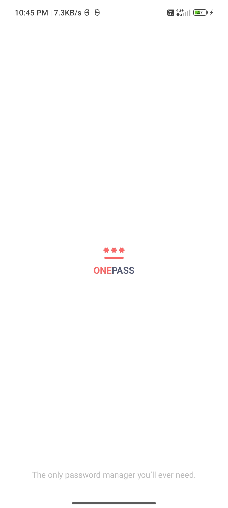
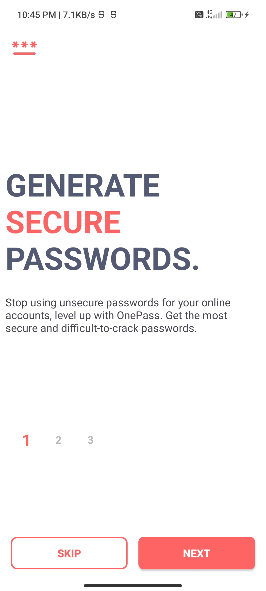
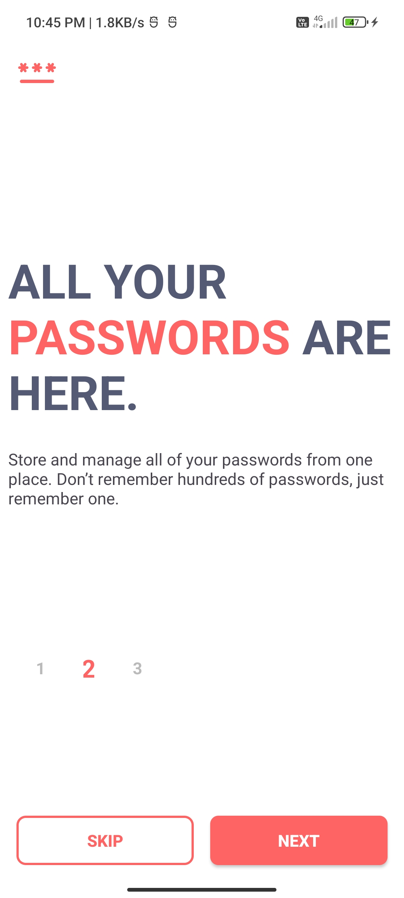
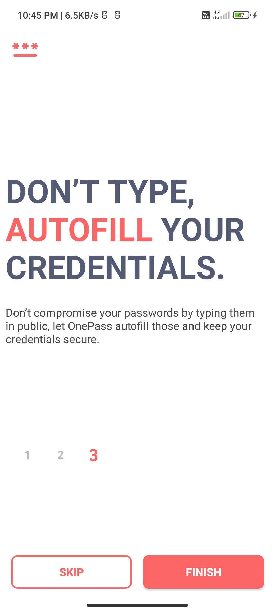
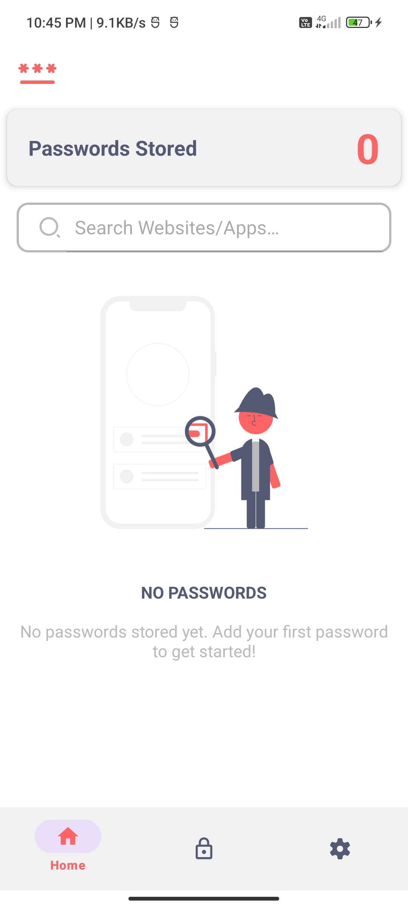
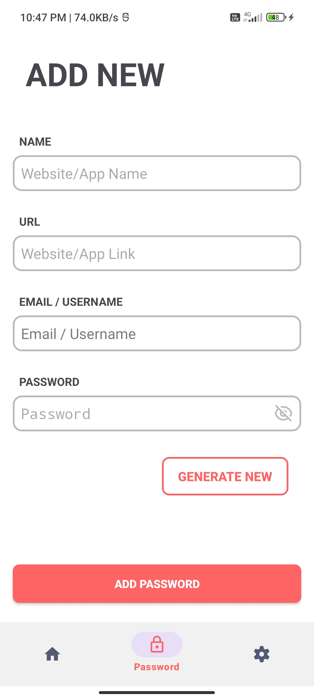
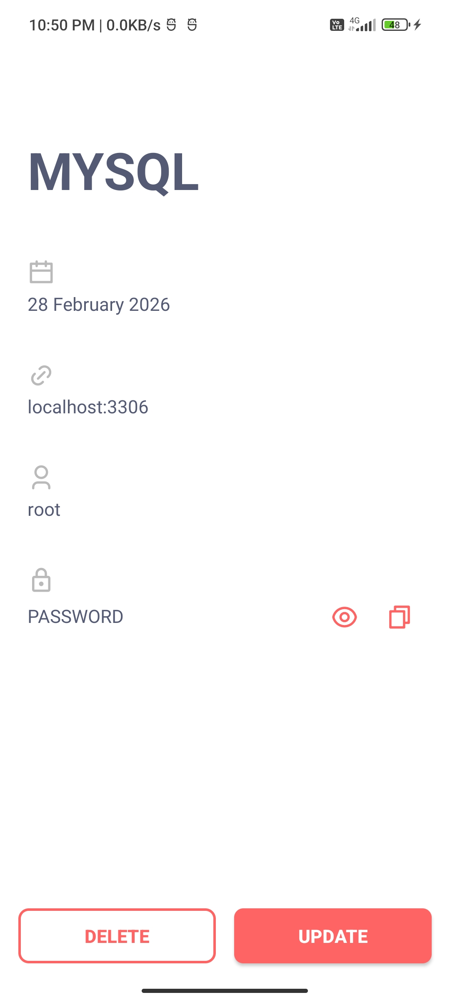
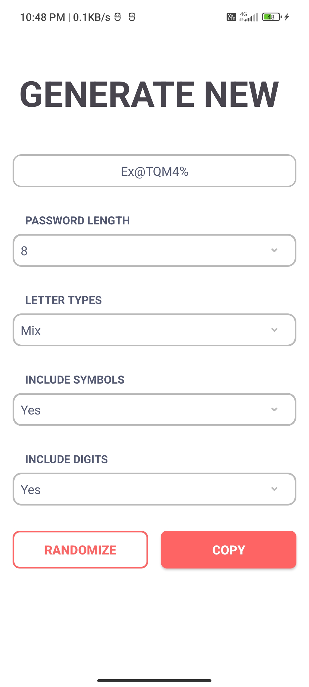
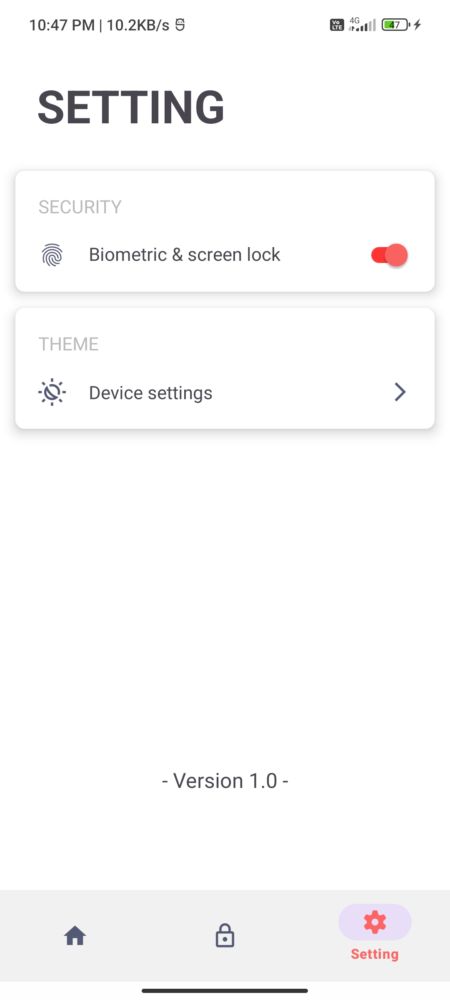

# 🔐 OnePass - Password Manager App

OnePass is a secure and user-friendly Android password manager application built using Java.  
It allows users to store, manage, generate, and protect passwords locally with enhanced security features like biometric authentication and screen capture prevention.

---

## 📸 Screenshots

  
  
  

  
  
  

  
  
  

---

## 🎯 Objective

The goal of OnePass is to provide a simple, secure, and offline password management solution that helps users:

- Store passwords safely
- Generate strong passwords
- Protect sensitive information
- Manage credentials efficiently

---

## ✨ Features

### 🏠 Dashboard
- Displays total number of saved passwords
- Clean and modern UI
- Search functionality to quickly find accounts

### ➕ Password Management
- Add new passwords (App/Website name, URL, Username, Password)
- Update existing passwords
- Delete passwords
- View full password details

### 🔍 Search Functionality
- Real-time filtering using SearchView
- Updates RecyclerView dynamically

### 🔑 Password Generator
- Generate passwords from 6 to 32 characters
- Option to include:
  - Uppercase letters
  - Lowercase letters
  - Digits
  - Symbols
- Random and secure password generation

### 👁 Password Visibility Toggle
- Show/Hide password option in Add & Update screens

### 📋 Copy to Clipboard
- Copy password securely with one tap

### 🧠 Biometric Authentication
- Enable/Disable biometric login from settings
- Supports fingerprint or face authentication
- Secure app access

### 🚫 Screen Capture Protection
- Prevents screenshots and screen recording
- Protects sensitive user data

### 🌗 Theme Support
- Light Mode
- Dark Mode
- System Default Mode
- Theme preference is saved permanently

### ⚙️ Settings Screen
- Toggle biometric authentication
- Choose app theme
- Manage security preferences

---

## 🛠️ Tech Stack

- **Language:** Java
- **Database:** Room Database (SQLite abstraction)
- **UI:** XML + ViewBinding
- **Authentication:** AndroidX Biometric
- **Design:** Material Components

---

## 🔐 Security Implementation

- Local data storage using Room Database
- Biometric authentication for secure access
- FLAG_SECURE enabled to block screen recording and screenshots
- No external server dependency (fully offline app)

---

## 📱 Installation

### Option 1: Run via Android Studio
1. Clone the repository: https://github.com/sritam-behera-716/OnePass-Password-Manager.git
2. Open in Android Studio
3. Sync Gradle
4. Run on emulator or physical device

### Option 2: APK
- Download the APK file:- https://github.com/sritam-behera-716/OnePass-Password-Manager/releases/download/v1.0/app-release.apk
- Install on your Android device

---

## 🤝 Contribution

Currently this is a personal learning project.  
Suggestions and improvements are always welcome.

---

## 📩 Contact

If you would like to try the APK or explore the source code, 
feel free to connect with me on LinkedIn or reach out via direct message.
